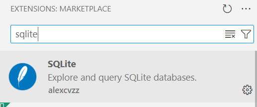

### VScode (PC oder Codespaces) mit SQLite verknüpfen
#### Schritt 0 Neues Repository Datenbanken anlegen mit Readme-Datei

#### Schritt 1 Extension SQLite installieren
Wählen Sie das Menü Erweiterungen aus und suchen Sie nach sqlite.

Diese Erweiterung installieren. 
#### Schritt 2 - Sqlite-Datenbank anlegen
Um eine Datenbank anzulegen, muss im ersten Schritt nur eine leere Datei im Explorer angelegt werden mit dem Namen der Datenbank und der Dateiendung db. 

#### Schritt 3 - Tabellen erzeugen 
```sql
-- Erstelle die Tabelle "Film"
CREATE TABLE IF NOT EXISTS Film (
    FilmID INTEGER PRIMARY KEY,
    Titel TEXT NOT NULL,
    Länge INTEGER NOT NULL,
    Jahr INTEGER NOT NULL,
    RegisseurID INTEGER,
    FOREIGN KEY (RegisseurID) REFERENCES Regisseur(RegisseurID)
);

-- Erstelle die Tabelle "Regisseur"
CREATE TABLE IF NOT EXISTS Regisseur (
    RegisseurID INTEGER PRIMARY KEY,
    Vorname TEXT NOT NULL,
     Nachname TEXT NOT NULL,
    Geburtsdatum DATE
);
```
#### Schritt 4 - Tabellen füllen 
```sql
-- Füge die Regisseure ein
INSERT INTO Regisseur (Vorname, Nachname, Geburtsdatum) VALUES
('Chris', 'Columbus', '1958-09-10'),
('James',  'Wan', '1977-02-27'),
('Francis Ford', 'Coppola', '1939-04-07'),
('Ridley', 'Scott', '1937-11-30'),
('Michel',  'Hazanavicius', '1967-03-29');

-- Füge die Filme ein und setze die entsprechenden Foreign Keys
INSERT INTO Film (Titel, Länge, Jahr, RegisseurID) VALUES
('Harry Potter 1', 159, 2001, 1),    -- Chris Columbus
('Insidius', 142, 2010, 2),          -- James Wan
('Der Pate', 175, 1972, 3),          -- Francis Ford Coppola
('Der Marsianer', 151, 2015, 4),     -- Ridley Scott
('Intime', 109, 2011, 5);            -- Michel Hazanavicius
```

#### Anmerkung
Zu empfehlen ist die Dateien mit dem Create-Script und dem Insert-Script auch jeweils in einer Datei zu speichern. Diese erhalten die Endung sql.

