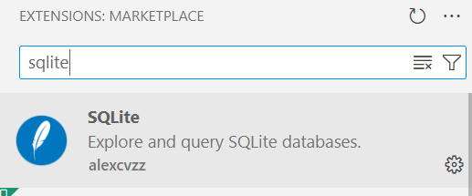
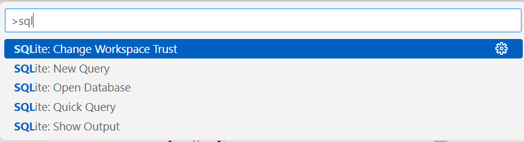

### VScode (PC oder Codespaces) mit SQLite verknüpfen
#### Schritt 1 Extension SQLite installieren


#### Schritt 2 - Sqlite verwenden
- Ctrl + Shift + P
(Befehlsliste öffnen) 
- nach sql suchen


#### Schritt 3 - Beispiel-Datenbank erzeugen
```sql
-- Erstellung der Users Tabelle
CREATE TABLE Users (
    UserId INTEGER PRIMARY KEY AUTOINCREMENT,
    Username TEXT NOT NULL,
    Role TEXT CHECK(Role IN ('User', 'Admin')) NOT NULL
);

-- Erstellung der Devices Tabelle
CREATE TABLE Devices (
    DeviceId INTEGER PRIMARY KEY AUTOINCREMENT,
    DeviceName TEXT NOT NULL,
    Room TEXT NOT NULL
);

-- Erstellung der Status Tabelle
CREATE TABLE Status (
    StatusId INTEGER PRIMARY KEY AUTOINCREMENT,
    StatusName TEXT NOT NULL
);

-- Erstellung der Tickets Tabelle
CREATE TABLE Tickets (
    TicketId INTEGER PRIMARY KEY AUTOINCREMENT,
    DeviceId INTEGER,
    UserId INTEGER,
    AdminId INTEGER,
    IssueDate TEXT NOT NULL,
    IssueDescription TEXT NOT NULL,
    ResolutionDate TEXT,
    ResolutionDescription TEXT,
    StatusId INTEGER,
    FOREIGN KEY (DeviceId) REFERENCES Devices(DeviceId),
    FOREIGN KEY (UserId) REFERENCES Users(UserId),
    FOREIGN KEY (AdminId) REFERENCES Users(UserId),
    FOREIGN KEY (StatusId) REFERENCES Status(StatusId)
);

-- Einfügen von Beispieldaten in die Users Tabelle
INSERT INTO Users (Username, Role) VALUES ('Benutzer1', 'User');
INSERT INTO Users (Username, Role) VALUES ('Benutzer2', 'User');
INSERT INTO Users (Username, Role) VALUES ('Admin1', 'Admin');

-- Einfügen von Beispieldaten in die Devices Tabelle
INSERT INTO Devices (DeviceName, Room) VALUES ('Rechner1', 'Raum101');
INSERT INTO Devices (DeviceName, Room) VALUES ('Rechner2', 'Raum102');
INSERT INTO Devices (DeviceName, Room) VALUES ('Rechner3', 'Raum103');

-- Einfügen von Beispieldaten in die Status Tabelle
INSERT INTO Status (StatusName) VALUES ('Offen');
INSERT INTO Status (StatusName) VALUES ('In Progress');
INSERT INTO Status (StatusName) VALUES ('Erledigt');

-- Einfügen von Beispieldaten in die Tickets Tabelle
INSERT INTO Tickets (DeviceId, UserId, IssueDate, IssueDescription, StatusId) VALUES (1, 1, '2024-01-01', 'Defekter Bildschirm', 1);
INSERT INTO Tickets (DeviceId, UserId, IssueDate, IssueDescription, StatusId) VALUES (2, 2, '2024-01-02', 'Startet nicht', 1);
INSERT INTO Tickets (DeviceId, UserId, IssueDate, IssueDescription, StatusId, AdminId, ResolutionDate, ResolutionDescription) VALUES (3, 1, '2024-01-03', 'Langsamer Betrieb', 3, 3, '2024-01-04', 'Neustart erforderlich');
```
SELCT * FROM Users